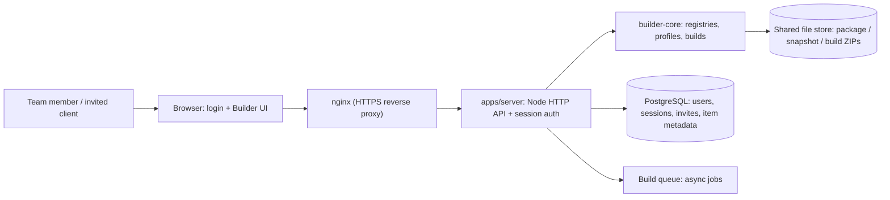

# Planning: v1 — Stabilization + Shared Hosted Web App

Status: draft for approval (not yet approved for implementation).

This document captures the complete planning discussion for the first stable version of WP Starter System. The goal is one combined release: stabilize the existing build pipeline and add a hosted web app on our own VPS, backed by PostgreSQL, where team members and invited clients can browse and build from each other's shared items. Others can view and use any shared item; only the owner edits or deletes their own items.

## Starting state (why planning was needed)

- Everything is currently local and file-based: `registry.json`, profile JSONs, snapshot ZIPs under `%USERPROFILE%\.wp-starter` (`WP_STARTER_HOME`).
- The GUI runs on `127.0.0.1` only; the Electron desktop app is WIP and unsigned.
- There is no server, no database, and no multi-user concept anywhere in the codebase.
- Therefore "make it accessible for everyone in an app with a shared DB" is a significant architectural shift, not an incremental feature.

## Confirmed decisions

| # | Question | Decision |
|---|---|---|
| 1 | App form for v1 | Hosted web app — central server, opened in a browser from anywhere |
| 2 | Who is "everyone" | Team + invited clients (login required) |
| 3 | Sharing permissions | Others may only view/use; the owner edits and deletes their own items |
| 4 | Backend hosting | Our own VPS/server |
| 5 | What is shared | All of it: packages, configuration snapshots, build profiles, design-system resources, sample content, built starter ZIPs |
| 6 | Scope of v1 | The shared multi-user app is included in v1 (single combined release) |

Important clarification from planning: "shared DB" means a database for users, ownership, and metadata, plus a shared file store for the big payloads (package/snapshot/build ZIPs). Nothing in the current security boundary changes — snapshots only ever contain exporter-whitelisted portable data, so they are safe to share; private production packages and credentials stay excluded either way.

## Target architecture

## New component: `apps/server/`

A Node.js HTTP server (minimal dependencies) exposing:

- **REST API** replacing the local-only GUI server calls, multi-user aware.
- **Session auth**: email/password (Argon2 hashing), HTTP-only secure cookies, CSRF protection.
- **Accounts**: `admin` / `member` / `client` roles. Admin creates team accounts; invite codes let clients register (fits "team + invited clients").
- **Static serving** of the web client.

### Database schema (mirrors existing file registries)

| Table | Purpose |
|---|---|
| `users`, `sessions`, `invites` | Identity, sessions, client invitations |
| `packages` | kind, slug, version, variant, sha256, file path, uploaded_by — mirrors `registry.json` |
| `snapshots` | Config snapshot metadata + zip path, uploaded_by |
| `profiles` | Profile JSON document, created_by, updated_at |
| `typography_profiles`, `color_profiles`, `design_systems`, `font_profiles`, `portable_templates`, `sample_content` | vNext/sample resources with owner |
| `builds` | Status, stages, manifest, artifact path, sha256, created_by |

### Permission model

- Signed-in users: read everything.
- Writes/deletes: only via `created_by` match (admins manage users/invites).
- Enforced at the API layer — builder-core stays permission-agnostic.

### Adaptation approach: wrap, don't rewrite

The server runs the existing builder-core APIs against one canonical shared library directory, then mirrors each mutation into the DB; list endpoints read the DB. This keeps builder-core stable, which also serves the stabilization goal.

- CLI: untouched.
- Local GUI: remains for offline/offline local use.
- Desktop app: remains WIP; installer stays unsigned for now (code signing deferred, documented).

## Track A — build order (no dates; each step gates the next)

1. **Stabilize current line** — run `npm run check` and `npm run verify:artifacts`, fix everything that surfaces, and triage known WIP items (unsigned installer: document, defer code signing).
2. **Server skeleton** — `apps/server/` scaffold, config via `.env` (DB URL, file-store paths, session secret, port), PostgreSQL migrations, health endpoint.
3. **Auth & accounts** — users/sessions/invites, role middleware, admin invite flow.
4. **Packages service** — upload/list/remove with checksum verification (reuses `inspectPackage`, `sha256File`) and DB mirroring.
5. **Snapshots → profiles** — import, list, compare, create/edit/delete with ownership.
6. **Design-system resources, portable templates, sample content** — same service pattern.
7. **Builds** — server-side async job queue (1–2 workers), staged progress, artifact storage, build history; disk quotas and upload size limits.
8. **Web client** — reuse `apps/gui/public/` front-end assets; add login page, current-user context, owner badges, "Shared by" labels, read-only controls for others' items, and an admin screen (users + invites).
9. **Deployment** — systemd unit, nginx server block, Let's Encrypt HTTPS, `pg_dump` backup cron, disk-space checks. Works whether the VPS is the Plesk machine (own server block/port) or a standalone server; own subdomain recommended (e.g. `builder.yourdomain.com`).
10. **v1 release** — version bump to `1.0.0`, README + `CHANGELOG.md`, new `docs/SERVER-DEPLOYMENT.md`, updated agent guide.

## Verification / definition of done

- `npm run check` green (compile + all tests + PHP lint), including new server tests.
- `npm run verify:artifacts` green.
- New tests under `apps/server/tests/`: auth, invite flow, permission denials (403), and an integration test where user A uploads and user B sees it read-only — using synthetic fixtures only, never private packages or real credentials.
- Manual acceptance: two browsers signed in as two users verify cross-visibility + edit denial.
- Deployment steps executed on a clean VPS; if not possible during the session, documented and flagged as environment-dependent.

## Traceability

| Step | Targets | Verification |
|---|---|---|
| 1 | Existing tests, triage notes | `npm run check`, `verify:artifacts` green |
| 2 | `apps/server/`, migrations | Server boots; migrations apply on test DB |
| 3 | auth module, middleware | Unit + invite-flow tests |
| 4 | packages service, `registry.ts` reuse | Upload/list tests |
| 5 | snapshots/profiles services | Ownership tests |
| 6 | resource services | Resource CRUD tests |
| 7 | build queue, `builder.ts` reuse | Build integration test |
| 8 | `apps/gui/public/` + client auth | Two-user manual test |
| 9 | systemd/nginx/backup config | Clean-VPS walkthrough (env-dependent) |
| 10 | version, docs, changelog | Final `npm run check` |

## Adjustable defaults (change any of these before approving)

- **PostgreSQL** is the recommendation; SQLite is a fallback if a separate DB server is unwanted.
- **Version `1.0.0`** for the first stable release (could be `0.2.0` instead).
- **Express-style minimal framework** vs. pure Node built-ins — minimal dependencies preferred.
- **Subdomain naming** (e.g. `builder.yourdomain.com`) and whether the app shares the Plesk VPS or runs on a separate one.
